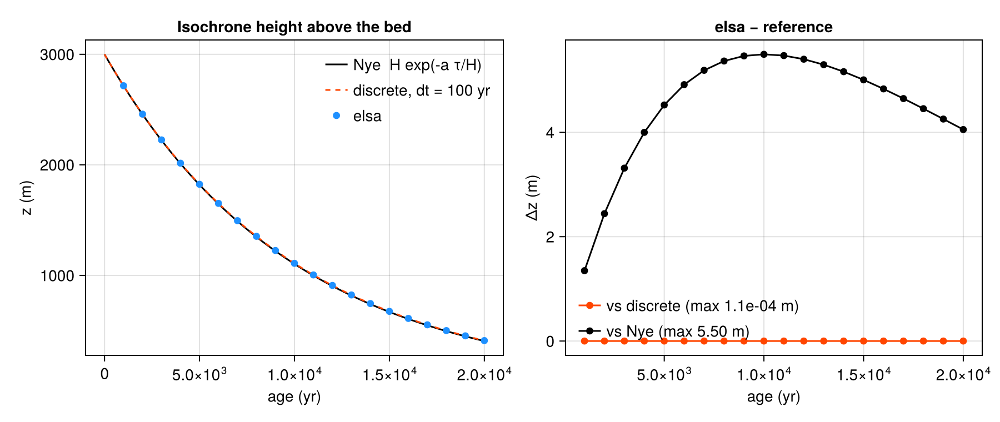

## What it tests

`test_column.x` is elsa's end-to-end quantitative check: the whole pipeline —
namelist, init, mass balance, normalization, layer insertion — driven at an ice
divide where the answer is known in closed form.

At a divide there is no horizontal flow. With constant ice thickness $H$ and
constant accumulation $a$, an isochrone laid down at the surface sinks under
uniform vertical strain, and Nye's steady solution puts it, after elapsed time
$\tau$, at a height above the bed of

$$
z(\tau) = H\,\exp\!\left(-\frac{a\,\tau}{H}\right).
$$

Source: [`src/test_column.f90`](https://github.com/fesmc/elsa/blob/main/src/test_column.f90).
Run it with `make run-column`.

## The point: vertical motion is emergent

elsa never computes a vertical velocity. Each coupling step it adds $a\,\Delta t$
to the top layer and renormalizes the column onto $H$, which multiplies every
layer height by $r = H/(H + a\,\Delta t)$. After $n = \tau/\Delta t$ steps,

$$
z = H\,r^{\,n}
  = H\left(1 + \frac{a\,\Delta t}{H}\right)^{-\tau/\Delta t}
  \;\longrightarrow\; H\,\exp\!\left(-\frac{a\,\tau}{H}\right)
  \quad\text{as } \Delta t \to 0.
$$

So the vertical thinning is a *consequence* of the layer bookkeeping, not
something imposed. The benchmark checks two separate things: that elsa lands on
the **discrete** recursion $H\,r^n$ exactly (a statement about the code), and
that this converges onto the **analytic** Nye profile at first order in the
coupling period (a statement about the scheme).

## Results

{#fig-column}

- **Against the discrete recursion: exact.** All 20 isochrones land on
  $H\,r^n$ to a relative error of $4.9\times10^{-15}$ — machine precision on the
  in-memory double-precision state.
- **Against Nye: first-order.** At $\Delta t = 100$ yr the maximum departure is
  5.5 m out of 3000 m of ice, and halving $\Delta t$ halves it. The convergence
  ratios measured at $\Delta t = 200, 100, 50$ yr are 1.997 and 1.998, against a
  first-order expectation of 2.

The shape of the residual in the right panel — zero at the surface, zero at the
bed, a smooth bump in between — is the fingerprint of a discretization error,
not a bug.

## Restart, in passing

The same benchmark asserts that `elsa_end` followed by a second `elsa_init` on
the same object succeeds. v2.0 freed only seven of its nine arrays, so the
second init aborted on an already-allocated array — which is why v2.0 could not
restart. The bit-identical restart round-trip is checked in
[greenland](greenland.qmd).
